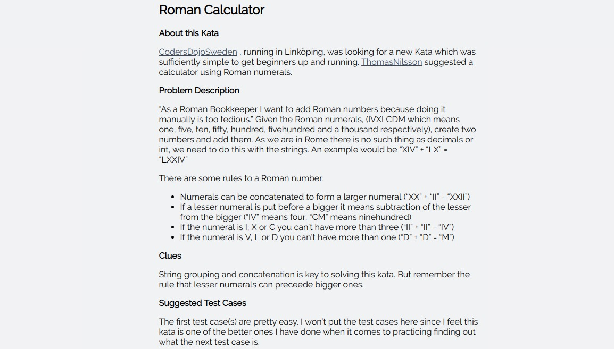

# Estágio CINQTECH Coding Dojo

## Ferramenta/Documentação

* [Cucumber Karate](https://github.com/intuit/karate)

## Desafio

O módulo **integration-test** possui o código **Cucumber Karate** que realiza os testes integrados/e2e na aplicação, porém propositadamente os testes estão falhando ;)

O objetivo do **Coding Dojo** será encontrar os erros e pendências do código de teste e corrigí-los.

## Objetivo deste Kata (Coding Dojô)

Esperamos que ao término da dinâmica o grupo esteja mais familiarizado com conceitos como:
  
  * Protocolo **HTTP**
  * Verbos **RestFul**
  * Testes automatizados
  * APIs **REST**
  * Cucumber Karate
  * JavaScript
  * Java
  
## Dicas de resolução do desafio
* Utilize **Baby Steps**
* Resolva os problemas mais simples primeiro
* **Foco em fazer os testes ficarem VERDE ;)**
* Procure observar arquivos comentados
* Procure entender a estrutura da ferramenta Cucumber Karate antes de rodar os testes
* Leia sempre as mensagens de erro, elas serão o seu guia
* Atente-se aos detalhes como textos ou nomes de arquivos escritos de forma incorreta
* **Use o POSTMAN para entender o request**
* Não tenha vergonha de fazer perguntas sobre conceitos, sintaxe, objetivo (Não existem perguntas idiotas ;) ...Principalmente em Dojôs)
## Como Funcionam os números romanos

